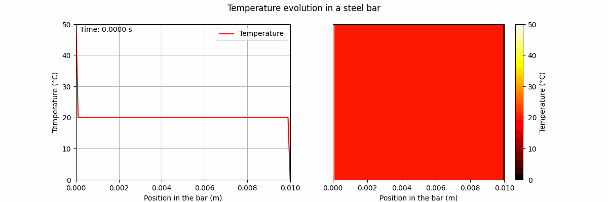
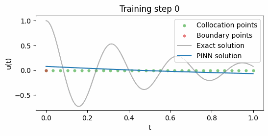
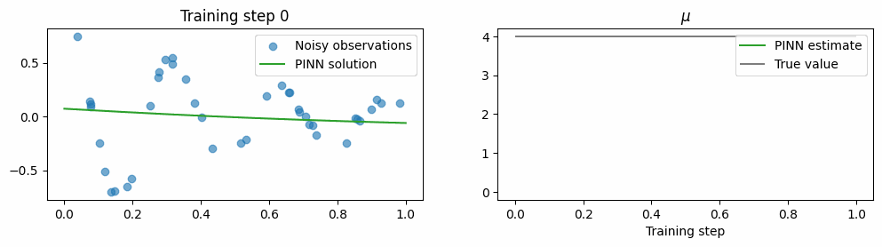
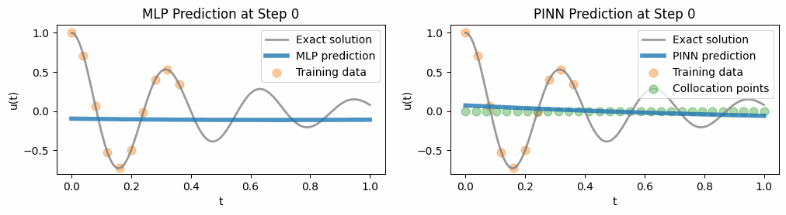

## 📂 pde_solving/

### 📓 [boundary.ipynb](pde_solving/boundary.ipynb)
Contains a short tutorial on basic techniques for solving boundary condition problems.

🌀 [diffusion.gif](pde_solving/diffusion.gif) - Numerical solution to the diffusion equation.

🌊 [wave.gif](pde_solving/wave.gif) - Intentionally numerically unstable solution to the wave equation.

### 📓 [initial.ipynb](pde_solving/initial.ipynb)
Contains a short tutorial on basic techniques for solving initial condition problems.

### 📓 [schrodinger.ipynb](pde_solving/schrodinger.ipynb)
Two different approaches to solving the time-dependent Schrodinger equation.

---

### 📓 [spring.ipynb](spring.ipynb)

## Training a PINN to simulate a damped harmonic oscillator [->](./spring.ipynb#task-1-train-a-pinn-to-simulate-the-system)

## Training a PINN to solve for an underlying parameter [->](./spring.ipynb#task-2-train-a-pinn-to-invert-for-underlying-parameters)

## Comparing MLP and PINN performance on partial data [->](./spring.ipynb#task-3-pinn-vs-mlp)

